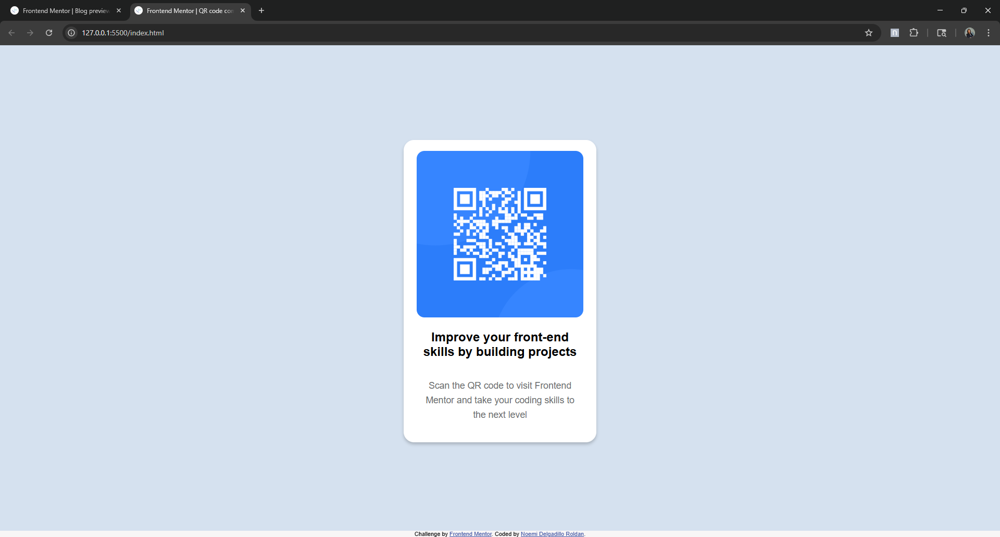

# Frontend Mentor - QR Code Component Solution

This is my solution to the [QR code component challenge on Frontend Mentor](https://www.frontendmentor.io/challenges/qr-code-component-iux_sIO_H).  
This challenge helped me practice building responsive layouts using HTML and CSS.

---

## 📋 Table of Contents

- [Overview](#overview)
- [Screenshot](#screenshot)
- [My Process](#my-process)
- [Built With](#built-with)
- [What I Learned](#what-i-learned)
- [Continued Development](#continued-development)
- [Useful Resources](#useful-resources)
- [Author](#author)

---

## 📌 Overview

This project recreates a QR code card layout based on a design provided by Frontend Mentor.  
The goal was to match the design as closely as possible while keeping the layout responsive.

---

## 📷 Screenshot



---

## ⚙️ My Process

I started by building the basic HTML structure and then styled it using CSS.  
I used Flexbox to center the component and made sure the layout worked well on different screen sizes.

---

## 🛠️ Built With

- HTML5
- CSS3
- Flexbox
- Responsive Design

---

## 📚 What I Learned

While working on this project, I learned:

- How to center elements using Flexbox
- How to structure clean semantic HTML
- How to use CSS variables for consistent styling
- How to make layouts responsive for mobile screens

Example:

```css
body {
  display: flex;
  justify-content: center;
  align-items: center;
  min-height: 100vh;
}
```
---

## 👩‍💻 Author

- Name: Noemi Delgadillo Roldan  
- LinkedIn: https://www.linkedin.com/in/noemidelgadilloroldan  
- GitHub: https://github.com/Noemi-24  
- Frontend Mentor: https://www.frontendmentor.io/profile/YOUR-USERNAME
